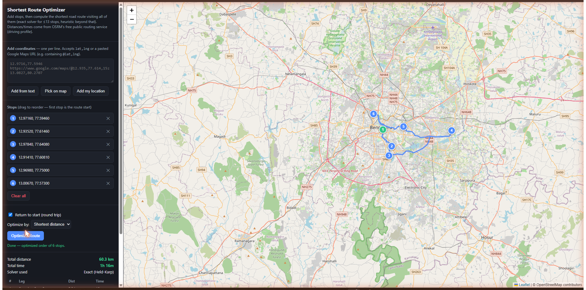

# Shortest Route Optimizer

A single-file, self-contained web app that takes a list of coordinates (or Google Maps links) and computes the shortest road route visiting all of them — with real road distances, an interactive map, and a one-click export to Google Maps.

No install and no build step. Serve `Shortest Route Finder.html` over `http://localhost` (one double-click with the included launcher) and use it.



---

## Contents

- [What it does](#what-it-does)
- [Prerequisites](#prerequisites)
- [How to run it](#how-to-run-it)
- [How to use it](#how-to-use-it)
- [How it works](#how-it-works)
- [Files](#files)
- [Limitations](#limitations)
- [Moving it to another machine](#moving-it-to-another-machine)
- [Troubleshooting](#troubleshooting)
- [Possible future improvements](#possible-future-improvements)

---

## What it does

1. You give it a set of stops (coordinates or pasted Google Maps URLs).
2. It fetches real road distances/times between every pair of stops.
3. It computes the order that minimizes total distance (or time) — visiting every stop exactly once, optionally returning to the start.
4. It draws the actual road route on a map and gives you a leg-by-leg breakdown plus a ready-to-open Google Maps link in that optimized order.

This is the classic **Traveling Salesman Problem (TSP)**, solved exactly for small stop counts and heuristically for larger ones.

---

## Prerequisites

- A modern browser (Chrome, Edge, Firefox, Safari). No installation of the app itself is required.
- **An active internet connection every time you use it.** The page loads two external things live:
  - [Leaflet.js](https://leafletjs.com/) from a CDN (`unpkg.com`) — the map library.
  - [OpenStreetMap](https://www.openstreetmap.org/) tiles — the map imagery.
  - [OSRM](http://project-osrm.org/)'s free public routing server (`router.project-osrm.org`) — road distances/times and route geometry.

If you're offline, the page still opens but the map won't render and "Optimize Route" will fail.

---

## How to run it

Double-click `Launch Route Finder.bat` (Windows, needs [Node.js](https://nodejs.org/)). It starts a small local web server and opens the app at `http://localhost:8000`. Keep the console window open while you use the app; close it when you are done.

Any other static server works too, for example `npx http-server . -p 8000` in this folder, then open `http://localhost:8000/Shortest%20Route%20Finder.html`.

**Why not just double-click the HTML?** Opened straight from disk (`file://`), the page sends no referrer, and the OpenStreetMap tile servers can reject those requests, so the map shows "access blocked". Served over `http://localhost` the browser sends a referrer and the tiles load. This was observed in practice; the exact server-side rule was not verified.

(There is still no backend or account involved. Everything runs client-side in the browser and talks directly to the free OSRM/OSM services over HTTPS.)

---

## How to use it

1. **Add stops**, using any combination of:
   - Pasting `lat,lng` pairs into the text box (one per line) and clicking **Add from text**.
   - Pasting a full Google Maps URL that contains coordinates (e.g. one with `@12.935,77.614` in it) — same box, same button.
   - Clicking **Pick on map**, then clicking points directly on the map.
   - Clicking **Add my location** to add your current GPS position (browser will ask for location permission).
2. **Reorder or remove stops** in the "Stops" list — drag to reorder (the first stop is the route's starting point), or click the ✕ to remove one. You can also drag a marker on the map to nudge its exact position.
3. Choose options:
   - **Return to start (round trip)** — checked by default. Uncheck for a one-way route that ends at the last stop instead of looping back.
   - **Optimize by** — shortest total distance, or fastest total time.
4. Click **Optimize Route**. The app will:
   - Fetch the road distance/time matrix between all stops.
   - Solve for the optimal visiting order.
   - Fetch and draw the real road-route geometry for that order.
   - Show total distance, total time, which solver was used, and a leg-by-leg table.
5. Click **Open this route in Google Maps** to launch the same stop order as turn-by-turn directions in Google Maps.

Your stop list, round-trip setting, and optimize-by choice are automatically saved to the browser's local storage as you work — closing the tab or reloading the page won't lose your progress. (This is per-browser, not synced anywhere — see [Limitations](#limitations).)

---

## How it works

### Coordinate parsing
Each line you paste is tested against a few patterns, in order:
- `@lat,lng` (appears in most Google Maps URLs)
- `!3dlat!4dlng` (appears in Google Maps "place detail" URLs)
- `?q=lat,lng` / `&query=lat,lng`
- A plain `lat,lng` pair

Shortened links (`maps.app.goo.gl/...`) aren't resolved — expand them to a full URL first (open the link once, copy the resulting long URL).

### Getting real road distances
The app calls OSRM's [Table service](http://project-osrm.org/docs/v5.5.1/api/#table-service) once with all stop coordinates, which returns an N×N matrix of road distances (meters) and durations (seconds) — using the **driving** profile.

### Solving the route (TSP)
- **12–13 stops or fewer:** solved *exactly* with the [Held–Karp dynamic-programming algorithm](https://en.wikipedia.org/wiki/Held%E2%80%93Karp_algorithm). This guarantees the mathematically shortest possible order — not just a good one. It runs in O(n²·2ⁿ) time, which is why it's capped around 13 stops (2¹³ = 8,192 subsets is fast; a few stops beyond that gets noticeably slower, and much beyond it becomes impractical in a browser tab).
- **More than 13 stops:** falls back to a heuristic — nearest-neighbor construction followed by 2-opt local-search improvement. This produces a very good route quickly but isn't guaranteed to be the absolute shortest.

The app shows which solver ran ("Exact (Held-Karp)" vs "Heuristic (Nearest-neighbor + 2-opt)") in the results panel.

### Persistence
Every change to the stop list (add/remove/reorder/drag) and every change to the round-trip/optimize-by options triggers a save to `localStorage` under a single key. On page load, that saved state is read back and restored before anything is rendered. No server or account is involved — it's purely client-side and scoped to that one browser (see [Limitations](#limitations)).

### Drawing the route
Once the optimal order is known, the app calls OSRM's [Route service](http://project-osrm.org/docs/v5.5.1/api/#route-service) with the stops in that order to get the actual road-following polyline (not just straight lines between points), and draws it on the Leaflet map.

---

## Files

```
route-optimizer/
├── Shortest Route Finder.html   ← the entire app (HTML + CSS + JS in one file)
├── screenshot.png               ← preview image used in this README
└── README.md                    ← this file
```

There is no build process, package.json, or dependency install — `Shortest Route Finder.html` is the complete, runnable artifact.

---

## Limitations

- **Driving only.** The free public OSRM server only hosts the driving/car profile — no walking, cycling, or public-transit routing. All distances/times/route shapes assume car travel; they'll be inaccurate if you're actually walking or cycling between stops.
- **Rate limits.** `router.project-osrm.org` is a free, best-effort public service, not a paid API. Under heavy or frequent use it may respond slowly or return errors.
- **Exact solving caps around 13 stops.** Beyond that, the app switches to a heuristic that's very good but not provably optimal.
- **No traffic awareness.** Distances/times reflect road network and speed limits, not live traffic conditions.
- **Persistence is local-only.** Your stop list and options are saved to that specific browser's `localStorage`, not to an account or the cloud — it won't follow you to a different browser or device, and clearing browser data wipes it. There's also no history of past routes, just the current one.
- **Single vehicle, single depot.** Solves one continuous route through all stops — no support for multiple vehicles, delivery capacity limits, or arrival time windows.
- **Shortened Google Maps links aren't parsed.** Expand `maps.app.goo.gl/...` links to their full URL first.

---

## Moving it to another machine

Everything the app needs is the single `Shortest Route Finder.html` file — copy it (or the whole folder) anywhere: USB drive, cloud storage, email attachment. On the new machine, just double-click it. The only requirement on the destination machine is a browser and internet access (see [Prerequisites](#prerequisites)) — no reinstallation of anything else.

---

## Troubleshooting

| Symptom | Likely cause | Fix |
|---|---|---|
| Map area is blank/grey | No internet, or OSM tile server is temporarily unreachable | Check your connection; reload the page |
| "Error: OSRM table request failed" | Public OSRM server is rate-limited or briefly down | Wait a bit and retry; reduce the number of stops |
| A pasted line doesn't turn into a stop | It didn't match a recognized coordinate/URL pattern | Use a plain `lat,lng` line, or a full (not shortened) Google Maps URL containing `@lat,lng` |
| "Optimize Route" seems to hang | Very large stop count on the exact solver, or slow network | Wait it out, or reduce stops below ~13 to trigger the fast heuristic path instead |
| Distances look off vs. what you'd expect walking | Routing uses the driving profile only | See [Limitations](#limitations) — walking/cycling isn't supported by the free server this app uses |

---

## Possible future improvements

*(Not implemented — listed here as options if requirements grow.)*

- Swap in a paid routing API (Google Directions/Distance Matrix, Mapbox) for walking/cycling profiles and traffic-aware ETAs.
- Self-host OSRM to remove the public-server rate limit.
- Named/exportable saved routes (multiple named lists, JSON import/export) beyond the current single auto-saved session.
- Multi-vehicle / capacity-constrained routing (Vehicle Routing Problem, not just TSP).
